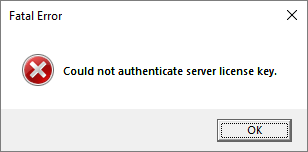

## Expected Warnings

The following FiveM server warnings are expected and safe to ignore:

* `Couldn't find resource sessionmanager.`

## Server Errors

### Database

* `mysql Error: -1 : Unable to connect to any of the specified MySQL hosts.`

  Check your `nfive\config\database.yml` configuration is correct and that a MySQL database is running and available.

* `MySql.Data.MySqlClient.MySqlPacket.ReadString` or similar MySQL read error

  Make sure your database charset is correctly set for NFive. See [Database Setup](getting-started-database.md#configuration) for instructions.

* `MySql.Data.MySqlClient.MySqlException: Table '<database>.boothistories' doesn't exist`

  If you try to start the server for the first time and receive this error, simply drop the database and try again.

### FiveM License Key

* `GlobalError: Could not authenticate server license key.`

  

  This error means you do not have a valid [FiveM license key](https://keymaster.fivem.net/) in `server.cfg`, make sure the file contains a valid `sv_licensekey` line.

## Client Errors

* `System.Runtime.Serialization.dll is not a platform image (even though the dir matches).`

  This error can be safely ignored.
